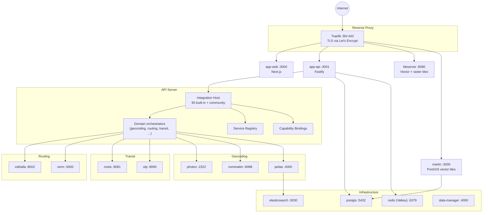

<div align="center">

# OpenMapX

**A fully self-hostable, open-data mapping platform — built entirely from open-source services and open data.**

[](https://github.com/OpenMapX/openmapx/actions/workflows/ci.yml)
[](https://github.com/OpenMapX/openmapx/actions/workflows/codeql.yml)
[](https://github.com/OpenMapX/openmapx/actions/workflows/docker.yml)
[](https://scorecard.dev/viewer/?uri=github.com/OpenMapX/openmapx)
[](https://nodejs.org)
[](https://pnpm.io)
[](https://www.typescriptlang.org)
[](https://nextjs.org)
[](https://fastify.dev)
[](https://maplibre.org)
[](https://turborepo.dev)
[](#contributing)

[Documentation](https://docs.openmapx.org) • [Self-Hosting](https://docs.openmapx.org/install/getting-started/) • [Architecture](https://docs.openmapx.org/developer/architecture/) • [CLI Reference](https://docs.openmapx.org/developer/cli-reference/) • [Integration System](https://docs.openmapx.org/developer/integration-system/)

</div>

---

OpenMapX is a complete mapping platform you run on your own infrastructure: search, routing, public transit, street-level imagery, POI data, weather, reviews, and dozens of overlays — all served from open data and open-source backends. The application stack is described declaratively by **service plugins** (`services/<slug>/service.json`) and **integration plugins** (`integrations/<id>/manifest.json`), and the entire Docker Compose deployment is rendered on demand from those manifests. There is no hand-maintained `docker-compose.yml`.

## Highlights

- **Complete mapping platform** — geocoding, traffic-aware and EV routing, public-transit planning and navigation, live vehicles, street-level imagery, POI search, knowledge enrichment, reviews, crowd reports, weather, and dozens of overlays
- **Two-layer plugin system** — *services* (containers: Valhalla, Nominatim, MOTIS, …) and *integrations* (app features: providers, overlays, data sources, tools). Both support community plugins from any Git URL
- **95 built-in integrations** and **23 built-in services** rendered into a generated `docker-compose.yml`
- **Self-host the provider stack** — routing, geocoding, transit, tiles, search, and data pipelines have local/open implementations; the lightweight app, database, cache, proxy, and data-manager form the required core
- **Open data** — OpenStreetMap, GTFS via Transitous, Wikidata, Wikipedia, Mapillary, NASA, NOAA, ECCC, DWD, MeteoAlarm, OpenAQ, USGS, NPS, and more
- **Privacy-first** — no third-party analytics; most upstream calls are proxied through your API server, and unavoidable direct browser asset loads are explicitly documented
- **Optional personal timeline** — connect an external or managed Dawarich account and view read-only day history without persisting timeline payloads in OpenMapX
- **First-class admin UI** — service catalog, integration config, capability bindings, audit log, users, jobs, compose preview, data workflows
- **Modern stack** — Next.js 16, Fastify 5, MapLibre GL JS 5, MUI 9, PostgreSQL + PostGIS, Valkey (Redis), Drizzle ORM, Better Auth, TypeScript 6 end-to-end

## Two plugin systems

OpenMapX has two complementary plugin layers. Knowing which is which makes everything else easier to read.

| Layer | Lives in | Manifest | Purpose |
|---|---|---|---|
| **Services** | `services/<slug>/` | `service.json` | Backend daemons that run as Docker containers (databases, routing engines, geocoders, transit engines, tile servers). Each declares its image, ports, volumes, capabilities (`provides:`), data inputs (`consumes:`), and exposure. |
| **Integrations** | `integrations/<id>/` | `manifest.json` | App-level features that consume services and external APIs (geocoding, routing, transit, overlays, data sources, photos, reviews, weather, knowledge). Each declares its domain, frontend components, backend routes, config schema, attribution, and which services it `requires:`. |

Both layers support **community plugins** managed from the admin panel and the `openmapx` CLI.

## Architecture at a glance



All containers communicate over the internal `openmapx` Docker network. Only Traefik (and any service that explicitly opts into `exposure.hostPorts`) is reachable from outside the host. See the [Architecture documentation](https://docs.openmapx.org/developer/architecture/) for the full picture.

## CLI

The `openmapx` CLI is the operator's command-line front end for the entire self-hosting workflow. It runs directly off TypeScript via Node's `--experimental-strip-types` (no build step).

```bash
pnpm openmapx services enable|disable|list|start|stop|restart|build|status|logs
pnpm openmapx compose render|up|down
pnpm openmapx data download|link|status
pnpm openmapx ext browse|list|install|update|remove # community extension bundles
pnpm openmapx integrations list|install|validate|build|package|remove
pnpm openmapx users list|promote|demote|verify
pnpm openmapx backup create|list|restore|delete
pnpm openmapx check                                  # environment + manifest validation
```

See the [CLI Reference](https://docs.openmapx.org/developer/cli-reference/) for every command, flag, and preset.

## Admin panel

Once the stack is running, `/admin` exposes the full operations surface (gated by `requireAdmin`):

- **Services** — installed services with status, manifest viewer, per-service config, logs, start/stop/restart
- **Service catalog** — community-installable services discovered from registered repositories
- **Service repositories** — register, refresh, remove community service Git repositories
- **Integrations** — per-integration config (5-layer cascade), capability binding picker, health, logs
- **Capability bindings** — pick which provider satisfies an integration's capability when multiple installed services match
- **Users** — Better Auth admin (roles, sessions, ban, impersonate)
- **Audit log, jobs, compose preview, data workflows, status, settings, store, activity**

See the [Admin panel](https://docs.openmapx.org/administration/admin-panel/) documentation for details.

## Tech stack

| Layer | Tech |
|---|---|
| Frontend | Next.js 16, React 19, MapLibre GL JS 5, MUI 9, Tailwind 4, Zustand, TanStack Query, next-intl, Serwist |
| API | Fastify 5, Drizzle ORM, Better Auth (email/password, OAuth OSM/Mapillary, passkeys, 2FA, admin role) |
| Data | PostgreSQL 18 + PostGIS 3.6, Valkey 8 (Redis-compatible), Elasticsearch (Pelias backend) |
| Routing & transit | Valhalla, OSRM, MOTIS, OpenTripPlanner |
| Geocoding | Photon, Nominatim, Pelias |
| Tiles | TileServer GL, Martin (PostGIS vector tiles) |
| Tooling | Turborepo, pnpm 11, Biome, Vitest, Husky + Commitlint, Changesets, Docker Compose v2, Traefik |
| Language | TypeScript end-to-end (Node 24+) |

## Contributing

Contributions are welcome — bug reports, feature requests, integrations, services, and documentation improvements all help. Before opening a PR:

1. Open an issue if the change is non-trivial so we can align on scope.
2. Run `pnpm lint`, `pnpm check-types`, and `pnpm test` locally — the CI workflow runs the same checks.
3. Use [Conventional Commits](https://www.conventionalcommits.org/) (enforced by Commitlint + Husky).
4. For new community plugins, see [Writing an integration](https://docs.openmapx.org/developer/writing-an-integration/) and [Community extensions](https://docs.openmapx.org/administration/community-extensions/).

## Acknowledgements

OpenMapX stands on a huge stack of open data and open-source software. Special thanks to:

[OpenStreetMap](https://www.openstreetmap.org) contributors · [Valhalla](https://github.com/valhalla/valhalla) · [OSRM](https://github.com/Project-OSRM/osrm-backend) · [MOTIS](https://github.com/motis-project/motis) · [OpenTripPlanner](https://github.com/opentripplanner/OpenTripPlanner) · [Nominatim](https://nominatim.org) · [Photon](https://photon.komoot.io) · [Pelias](https://github.com/pelias/pelias) · [Transitous](https://transitous.org) · [MapLibre](https://maplibre.org) · [TileServer GL](https://github.com/maptiler/tileserver-gl) · [Martin](https://github.com/maplibre/martin) · [Overpass API](https://overpass-api.de) · [Mapillary](https://www.mapillary.com) · [Wikidata](https://www.wikidata.org) / [Wikipedia](https://www.wikipedia.org) · [Mangrove Reviews](https://mangrove.reviews) · the many transit agencies who publish open data feeds.

## License

The OpenMapX product is licensed under **[AGPL-3.0-or-later](LICENSE)**; its reusable libraries (selected `packages/*`) are **Apache-2.0**. See [LICENSING.md](LICENSING.md) for the breakdown and rationale, and [CLA.md](CLA.md) for the Contributor License Agreement.

The **OpenMapX name and logo are trademarks** and are not covered by the code licenses — see the [Trademark Policy](https://openmapx.org/trademark).
