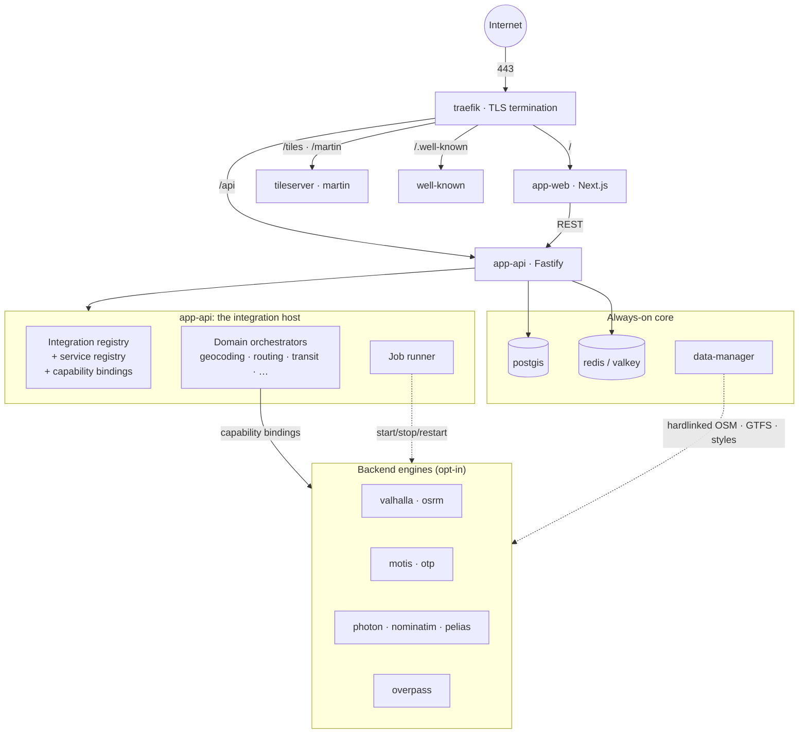
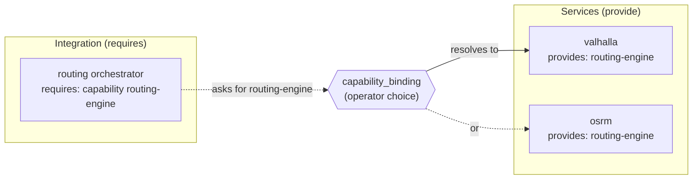
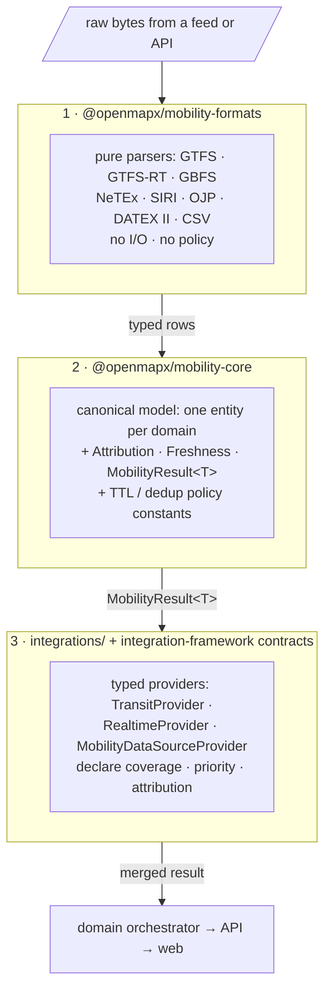

# Architecture

OpenMapX is a self-hosted map application assembled from two plugin systems —
**services** (backend daemons) and **integrations** (application features) —
that a compose renderer wires into a running stack. The
[overview](../overview/how-it-works.md) introduces that model; this page goes
underneath it: how the repository is laid out, how the containers fit together
at runtime, and how mobility data flows through three deliberately separated
layers before it reaches a browser.

If you are new to the project, read [How it works](../overview/how-it-works.md)
first. If you operate a deployment, [Managing services](../install/managing-services.md)
is the day-to-day companion to the runtime topology below.

## The monorepo

The repository is a [Turborepo](https://turborepo.com/) workspace driven by pnpm.
`pnpm-workspace.yaml` enrolls four globs — `apps/*`, `packages/*`,
`integrations/*`, and `services/data-manager` — and `turbo.json` orchestrates the
`build`, `dev`, `check-types`, and `test` pipelines across them. Node 24+ is
required.

```
openmapx/
├── apps/
│   ├── web/                  Next.js 16 frontend (MapLibre GL JS, MUI 9)
│   └── api/                  Fastify 5 BFF + integration host + admin API
├── packages/                 shared libraries (see below)
├── integrations/             built-in application features (manifest.json each)
├── custom_integrations/      community integrations (gitignored)
├── services/                 built-in service plugins (service.json each)
│   └── data-manager/         the one service that ships its own source
├── infra/docker/             generated compose + hardlink plan (gitignored)
└── docs/                     this documentation site
```

Two directories hold *generated output only*. `infra/docker/` is written by
`pnpm openmapx compose render` and never edited by hand — there is no
hand-maintained `docker-compose.yml`. `custom_integrations/` and the community
service tree under `services/.community/` are populated at runtime from Git URLs.

### Applications

| App | Stack | Responsibility |
| --- | --- | --- |
| `apps/web` | Next.js 16 · React 19 · MapLibre GL JS 5 · MUI 9 · Tailwind 4 · Zustand · TanStack Query · next-intl | The user-facing App Router UI. Layouts and request boundaries use Next.js normally; the interactive map, panels, and navigation shell are client components. The MapLibre instance is shared through React context rather than serialized into application state. |
| `apps/api` | Fastify 5 | The backend-for-frontend (BFF) gateway. It is *also* the integration host: it discovers, validates, configures, and runs every integration, resolves their service requirements, gates the admin API, and runs background jobs. |

The two never talk to backend engines directly through the browser. The web app
calls `apps/api`, and `apps/api` reaches the engines over the private Docker
network. This indirection is what lets the same frontend front a Valhalla or an
OSRM router without a code change.

### Key packages

Shared code lives in `packages/*`. Both applications consume these as
source-only workspace packages (most expose `main: ./src/index.ts` and are
transpiled by Next.js rather than pre-built), so a change in a package is picked
up without a separate build step.

| Package | Owns |
| --- | --- |
| `@openmapx/core` | The shared spine: domain types (`Place`, `Route`, geometry, `BBox`), Zustand stores, the typed API client, TanStack Query hooks, and the **services framework** (manifest schema, registry, the compose renderer, the `DataManagerClient`, capability resolution). |
| `@openmapx/integration-framework` | The manifest schema, registry, loader, the `IntegrationContext` runtime type, and the **typed provider contracts** (one per domain — `TransitProvider`, `RealtimeProvider`, `MobilityDataSourceProvider`, `GeocodingProvider`, `RoutingProvider`, `WeatherProvider`, and more). |
| `@openmapx/mobility-formats` | Pure, stateless parsers over raw bytes: GTFS, GTFS-RT, GBFS, NeTEx, SIRI, OJP, DATEX II, CSV. No I/O, no policy. |
| `@openmapx/mobility-formats-tomp` | The TOMP-API (OpenAPI-generated) client, split out so its codegen dependencies don't bleed into every bundle that touches the other formats. |
| `@openmapx/mobility-core` | The canonical mobility model — one entity type per domain, plus `Attribution`, `Freshness`, `MobilityResult<T>`, the TTL/dedup policy constants, and the GBFS client. |
| `@openmapx/db-schema` | Drizzle ORM table definitions shared between `apps/api` and `services/data-manager` (job tables, feed state, provider health). |
| `@openmapx/cli` | The `openmapx` operator command line — services, compose, data/POI ingest, integrations/extensions, users, backups, cache, Transitous, and diagnostic checks. |
| `@openmapx/i18n` | Locale JSON for `en` and `de`, plus a `check-translations` gate that fails CI when locales drift. Consumed by `apps/web` (next-intl) and `apps/api` (integration string lookups). |
| `@openmapx/poi-source-registry` | A mutable in-process store of declared POI sources. Loaded independently by both `apps/api` (reader) and `services/data-manager` (ingest), so the same integration code drives both. |
| `@openmapx/presets` | OSM preset matching and category chips, built on iD's tagging schema. |
| `@openmapx/ev-charge-planner` | Pure EV trip planning: vehicle energy models, charge curves, corridor candidates, matrix scoring, network/availability/tariff policy, and itinerary estimates. |
| `@openmapx/extension-cli`, `@openmapx/extension-sdk` | Standalone community-extension authoring tools and the stable public types/runtime helpers an external bundle may import. |
| `@openmapx/openconditions-contrib-client` | Browser-side device enrollment, canonical claim validation/signing, reporting tokens, and signed votes for crowd reports. |
| `@openmapx/transitous-core` | Shared Transitous catalog normalization and feed-selection logic used by the CLI, API, and data pipeline. |
| `@openmapx/place-ids`, `@openmapx/mangrove-client`, `@openmapx/mangrove-react`, `@openmapx/command-palette`, `@openmapx/noaa-coops-data`, `@openmapx/ourairports-data`, `@openmapx/hardlinks`, `@openmapx/motis-feed-proxy-config`, `@openmapx/hey-api-client-fetch` | Focused utilities — stable place identifiers, Mangrove review signing, the search palette, bundled open datasets (tide stations, airports), the local hardlink applier, the MOTIS feed-proxy nginx config renderer, and a pinned `@hey-api/client-fetch` shim. |

## Runtime topology

A deployment is a set of Docker containers on one private network. The
[overview diagram](../overview/how-it-works.md#a-deployment-at-a-glance) shows
the shape; here is what each tier is actually doing.



**The reverse proxy.** [Traefik](https://traefik.io/) terminates TLS and is the
only container with a public surface. Every other container is reachable *only*
on the internal `openmapx` Docker network, addressed by service id
(`http://valhalla:8002`, `http://nominatim:8080`). A service becomes
externally reachable only if its manifest opts in — either with a Traefik route
(`exposure.proxy`) or a host-port binding (`exposure.hostPorts`, which defaults
to loopback). Routing precedence is path-based: `app-web` claims `/` at the
lowest priority so that more specific prefixes — `/api`, `/tiles`, `/martin`,
`/.well-known` — win.

**The always-on core.** A handful of services are selected by default —
`traefik`, `well-known`, `app-api`, `app-web`, `postgis`, `redis`, and
`data-manager`. Everything heavy (routing engines, geocoders, transit engines,
the Overpass server, tile servers) is opt-in: you add it to the *selection* and
re-render. PostGIS is the system of record; Redis (Valkey) is the cache.

**`app-api` as integration host.** This is the architectural center. The Fastify
process is one container, but it wears several hats at once:

- Static routes registered directly on Fastify — `/health`, `/api/places`,
  `/api/isochrone`, `/api/tiles/*`, `/api/admin/*`, and so on.
- The **integration host**, which loads every integration's `setup(ctx)` and
  exposes their HTTP routes through a single dispatcher (more on this below).
- The **service registry**, which validates `service.json` manifests and answers
  "what's installed, what does it provide, what URL is it on."
- The **job runner**, which executes long operations off the request path —
  `service.start` / `stop` / `restart`, data downloads and refreshes, community
  store installs — and reports progress the admin UI can poll.

A global `onRequest` hook applies tiered, IP-keyed rate limits before any route
runs, and admin routes carry a `requireAdmin` preHandler on top. Fastify runs
with `trustProxy` set for Traefik, so limiters and the audit log see the real
client IP — while the loopback admin short-circuit deliberately reads the raw
socket address, so a forged `X-Forwarded-For` can't bypass it.

**The data plane behind the engines.** The `data-manager` service owns the
`/data` tree. It downloads OSM extracts, GTFS feeds (via the Transitous
pipeline), and map styles, then *hardlinks* them into each consumer's directory
so several engines share one multi-gigabyte file at zero disk cost. The compose
renderer plans those links from each service's `consumes:`/`produces:`
declarations; `data-manager` applies the plan. See
[Managing services](../install/managing-services.md) for the operator workflow.

## The capability model

Services and integrations never name each other directly when they can avoid it.
Instead they meet through **capabilities** — free-form strings like
`routing-engine`, `geocoder`, `transit-engine`, `tile-server`, `osm-query`.



- A **service** declares what it offers with `provides: [...]`.
- An **integration** declares what it needs with `requires: [...]`, either by
  capability (`{ "capability": "geocoder" }`) or by a specific service id
  (`{ "service": "valhalla" }`), and may mark a requirement `optional`.
- A **binding** resolves the two. When exactly one installed service satisfies a
  capability, the host auto-selects it. When several do, an operator picks one in
  the admin panel; that choice is stored in the `capability_binding` table and
  consulted at host startup. An unmet `optional` requirement falls through to the
  integration's own public-API fallback (for example, the routing orchestrator
  reaches the public Valhalla endpoint when no local router is bound).

This indirection is the project's central design choice. Swapping Valhalla for
OSRM, or Photon for Pelias, is a deployment decision an administrator makes — not
a code change a developer ships.

### Domains and orchestrators

Every integration registers into one or more **domains** — `geocoding`,
`routing`, `transit`, `live-transit`, `data-source`, `poi-search`, `photos`,
`reviews`, `weather`, `knowledge`, `map-overlay`, `street-level-imagery`,
`road-conditions`, `gtfs-catalog`. Each domain has
a dedicated **orchestrator integration** (`integrations/geocoding/`,
`integrations/routing/`, `integrations/transit/`, and so on) that owns the
domain's public API routes and a registry of providers. Provider integrations
declare a dependency on their orchestrator, so the host's topological sort always
loads orchestrators first.

The orchestrator's job is to merge across providers, and the strategy varies by
domain: geocoding and weather run a **fallback chain** (first non-empty wins);
data-source, photos, reviews, and poi-search **merge everything**; transit
**fans out and deduplicates** across providers matched by coverage box and
prefix; map overlays are **independent layers**. The transit orchestrator is the
most involved — it routes id-bearing requests by provider prefix (`bvg:`, `mo:`,
`g-<slug>:`), waterfalls trip-planning by priority, fans stops and alerts out in
parallel, and deduplicates overlapping results.

## The integration host lifecycle

When `apps/api` boots, the host runs the same sequence it re-runs on every hot
reload:


1. **Discover** — scan `integrations/` and `custom_integrations/` for
   `manifest.json`.
2. **Validate** — the Zod manifest schema plus business rules; a failing
   manifest is skipped with a warning, never crashing the host.
3. **Topological sort** — order by each manifest's `dependencies:` so
   orchestrators load before their providers.
4. **Resolve config** — a five-layer cascade, highest wins: environment variable
   → local `config.json` → encrypted vault → database (admin UI) → schema
   default.
5. **Resolve `requires:`** — match each integration's requirements against the
   service registry and the capability bindings.
6. **`setup(ctx)`** — call every enabled integration with a rich
   `IntegrationContext`. Through `ctx`, an integration registers providers
   (`ctx.registerTransitProvider`, `ctx.registerMobilityDataSource`,
   `ctx.registerProvider(domain, …)` for the rest), declares POI sources, mounts
   HTTP routes (`ctx.registerRoute`), and reaches its cache, logger, secrets, and
   bound services.
7. **Seed health** — an initial health sweep runs ~5 s after startup and repeats
   every 60 s, populating the per-integration health the admin panel surfaces.

Integration HTTP routes are not registered as individual Fastify routes. They go
into one in-memory table that a single catch-all dispatcher consults, so
`POST /api/integrations/reload` can genuinely replace the routing table without
restarting the process — re-discovering manifests, re-resolving bindings, and
re-running `setup()` live.

:::note[Production vs. development reload]
In development the host mtime-busts backend module URLs so in-place edits reload.
In production, Node's ESM loader caches modules permanently, so updating an
already-loaded community integration requires
`pnpm openmapx services restart app-api`. Brand-new installs reload without a
restart.
:::

## The mobility data plane

Transit, shared-mobility, parking, fuel, and EV-charging are data-heavy domains
with messy upstream formats and strict attribution obligations. Rather than let
each provider improvise, OpenMapX routes all of it through three packages, in a
fixed order. The separation is the point: each layer has one job, and nothing
below it knows about anything above it.



**Layer 1 — formats (`@openmapx/mobility-formats`).** Stateless functions over
bytes. `parseGtfsRealtime(bytes)` returns a typed feed message;
`parseSiri(xml)` decodes the envelope and a `siri-transit` companion normalizes
it toward the canonical model. No network, no caching, no policy — pure
`bytes → typed rows`, which makes this layer trivially testable and reusable by
both request-path providers and the off-request GTFS importer. TOMP lives in the
sibling `mobility-formats-tomp` package only because its OpenAPI codegen pulls in
heavy dependencies that shouldn't ride along with the lean parsers.

**Layer 2 — canonical model (`@openmapx/mobility-core`).** One TypeScript type
per domain entity (transit, shared-mobility, parking, fuel, EV-charging), one
`Attribution` shape, one `Freshness` envelope, and one wrapper that every
provider returns:

```ts
interface MobilityResult<T> {
  data: T;
  attributions: Attribution[];
  freshness: Freshness;
}
```

Because `Attribution` and `Freshness` are defined once, the orchestrator can
merge attributions from many providers — deduplicated, precedence preserved, so
the primary contributor renders first — and the UI's attribution strip is always
correct without per-provider special-casing. The TTL and dedup *policy* (cache
lifetimes per data class, dedup radii, name-similarity thresholds) lives in one
`policy.ts`, so cache and deduplication behavior is consistent across every
mobility domain rather than reinvented per integration. This layer also carries
the GBFS client and station resolver that shared-mobility providers build on.

**Layer 3 — providers (`integrations/*`).** A concrete provider implements one
of the typed contracts in `@openmapx/integration-framework/src/contracts/` —
`TransitProvider` (stops, departures, planning, alerts, with a capability bitmap
so the orchestrator dispatches by declared capability rather than reflection),
`RealtimeProvider` (vehicle positions, trip updates, situation feeds), or
`MobilityDataSourceProvider` (bike/scooter/car-sharing, parking, fuel, EV
charging). Each provider declares its coverage box, priority, and a static
`attribution`, and returns `MobilityResult<T>`. The orchestrator dispatches on
capability, coverage, and current health.

### Why split it this way

A naive design would have each transit provider parse its own GTFS, define its
own stop type, and stamp its own attribution. That collapses three concerns —
*decoding*, *modeling*, and *sourcing* — into every provider, and they drift.
The three-layer split forces them apart: a parser bug is fixed once; the
canonical model means a stop from MOTIS and a stop from a HAFAS endpoint are the
same shape; and attribution plus freshness are structural, not optional. Adding a
new transit source is then small — implement one contract, lean on the existing
parsers and model — which is what keeps the long tail of regional providers
maintainable.

The same `MobilityResult<T>` discipline does **not** extend to the non-mobility
domains (geocoding, routing, weather, reviews, photos, knowledge), which still
use ad-hoc provider shapes registered through `ctx.registerProvider(domain, …)` —
there is no comparable canonical cross-domain model for them yet, and the merge
logic lives entirely in each orchestrator.

### The POI ingest exception

A few sources — national EV-charging registries, parking catalogs — are too
large to load per request. Instead of the eager `search(bbox)` shape, the
integration declares its sources (`ctx.registerPoiSources(...)`) and an
off-request pipeline in `data-manager` fetches, parses, validates, and writes
them: static rows land in PostGIS with a GiST index (swapped in atomically via
`DROP`/`RENAME`), and live rows land in Redis with a TTL. At request time a thin
`apps/api` provider does a bounding-box `ST_Intersects` query plus a Redis read
and wraps the result back into a `MobilityResult<T>` — so even bulk POI datasets
present the same canonical shape to the orchestrator.

## Where to go next

- **[Integration system](./integration-system.md)** — the manifest, the
  `IntegrationContext`, domains, and config resolution in depth.
- **[Service manifest](./service-manifest.md)** — the `service.json` schema,
  capabilities, exposure, and data sharing.
- **[Writing an integration](./writing-an-integration.md)** — build a provider
  end to end.
- **[CLI reference](./cli-reference.md)** — every `openmapx` command.
- **[Development setup](./development-setup.md)** — run the stack locally.
