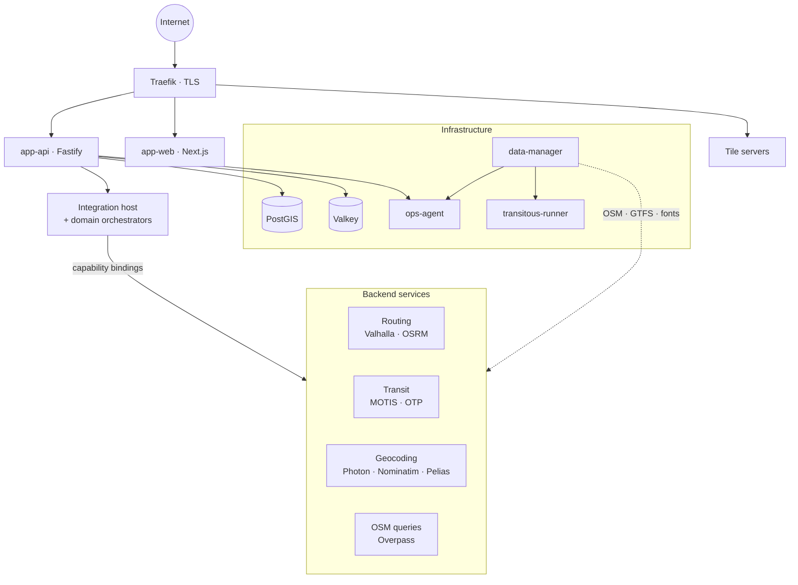

# How it works

OpenMapX is built from two plugin layers and a compose renderer that wires them
into a running stack.

## Services: the backend layer

A **service** is a backend daemon that runs as a Docker container — a database, a
routing engine, a geocoder, a transit engine, a tile server. Each one is
described by a `service.json` manifest under `services/<slug>/` that declares:

- the container image, ports, and volumes;
- the **capabilities** it provides (for example `routing-engine`, `geocoder`,
  `transit-engine`, `tile-server`);
- the data it **consumes** (OSM extracts, GTFS feeds, prepared tiles);
- how, if at all, it is exposed outside the host.

You enable the services you want and run `openmapx compose render`; the renderer
reads the enabled manifests and writes `docker-compose.generated.yml`. There is
no hand-maintained compose file.

## Integrations: the feature layer

An **integration** is an app-level feature described by a `manifest.json` under
`integrations/<id>/`. Integrations are where user-facing capabilities live: the
geocoding orchestrator, the routing orchestrator, transit providers, map
overlays, external data sources, photos, reviews, and place enrichment. A
manifest declares the integration's domain, its frontend components and backend
routes, a typed config schema, attribution, and the services it **requires**.

## Capabilities tie the two together

Services *provide* capabilities; integrations *require* them. This indirection is
what keeps OpenMapX swappable: the routing integration asks for a
`routing-engine`, and whether that is Valhalla or OSRM is a deployment choice,
not a code change. When more than one running service can satisfy a requirement,
an administrator picks the binding.

## A deployment at a glance

Every container talks over a private `openmapx` Docker network. Only the reverse
proxy — and any service that explicitly opts into exposing a host port — is
reachable from outside the host. The API server (`app-api`) is itself a
container: it hosts the integration framework, gates the admin endpoints, and
resolves integration requirements against the service registry.

## Where data comes from

OpenMapX runs on open data. A dedicated **data-manager** service owns the
`/data` tree: it downloads OSM extracts, GTFS feeds (via Transitous), and glyph
fonts (`tile-fonts`), then hardlinks them into place so multiple services can
share the same files without copying. Map styles and sprites are statically
bundled directly into the `app-web` frontend. The private **ops-agent** broker
isolates Docker socket authority and host lifecycle management so application
containers run unprivileged. Some integrations also call external APIs for data that
is proprietary, real-time, or impractical to self-host — traffic, street-level
imagery, certain regional transit — always proxied through your server.

## Where to go next

- **[Getting started](../install/getting-started.md)** — set up your own
  deployment with Docker Compose.
- **[Architecture](../developer/architecture.md)** and the
  **[integration system](../developer/integration-system.md)** — a deeper look at
  how OpenMapX is built.
